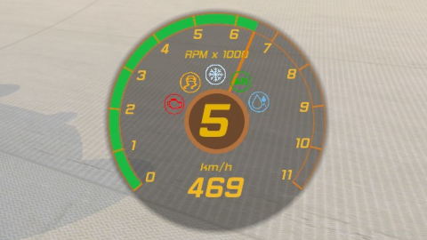

# Nitro Dashboard

**Overlay to shows Gauge with following info:**

- Engine RPM Gauge
  - Color change when car is about gear up or down
- Vehicle Speed
- Current Gear
- AirBrake indicator
- Engine indicator
- Icing indicator
- Drift indicator
- Turbo and Boost states

## installation

**1. Download the plugin**

- Download latest signed release through [Openplanet.nl](https://openplanet.nl/files/102)
- Latest unsigned **Club Access** only releases can be available before Openplanet release on [Github repo](https://github.com/nitroquery/NitroDashboard/releases)

**2. Extract downloaded plugin into your Openplanet User Folder**

`NitroDashboard.op` should be copied to `<user-folder>/Plugins/`,

**NOTICE! Do not copy plugin file into Legacy `Script` Directory**

**3. Enable Nitro Dashboard Plugin**

Plugin will be loaded when you restart the game or if you have the Game open you can select from Openplanet menu `<F3>` `Developer -> Restart script engine`

## Bug Reports and Feature Requests

You can report any issues or place feature requests on [Github Issues](https://github.com/nitroquery/NitroDashboard/issues)

**Credits**

Plugin was inspired by
- *frozentire's* [Gauge and Medal Extension](https://openplanet.nl/files/63) plugin
- *benj9029's* [Pad Viewer](https://openplanet.nl/files/64) plugin

**Many thanks for @codecat (הimz¦Miss ) for helping with some of the code and prompt feedback.**
